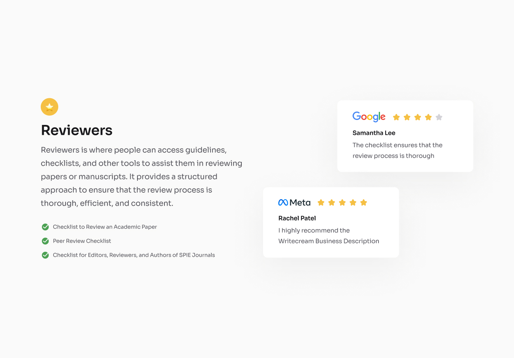
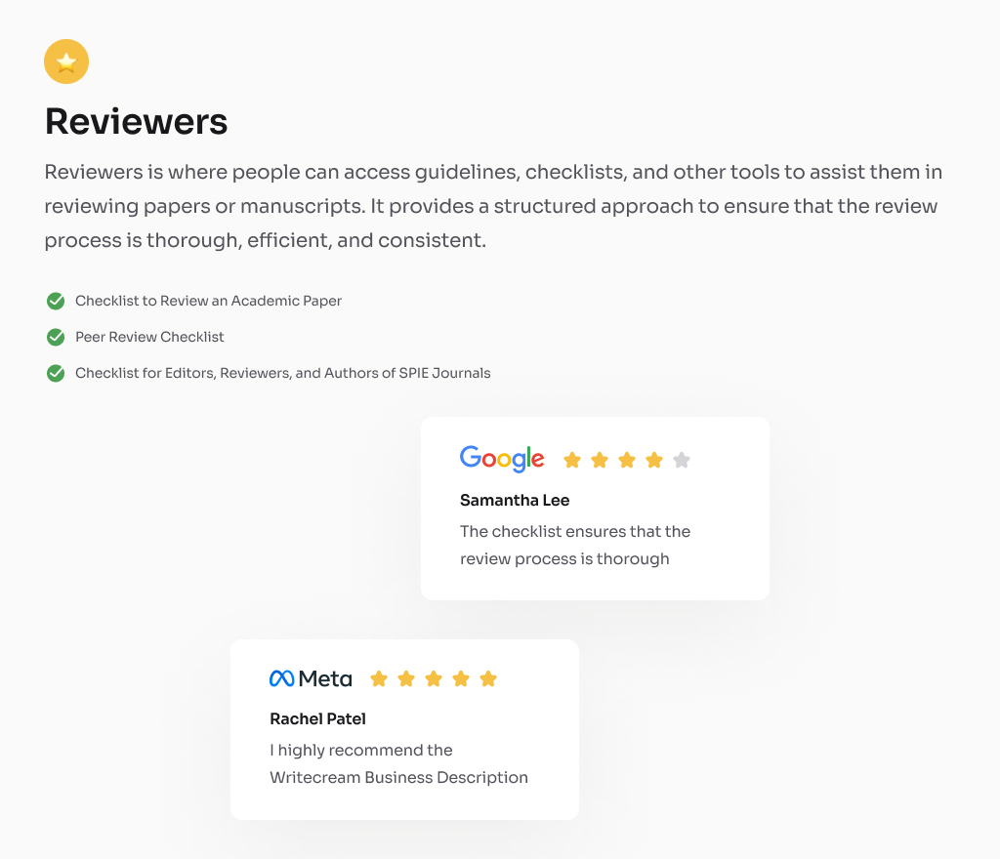
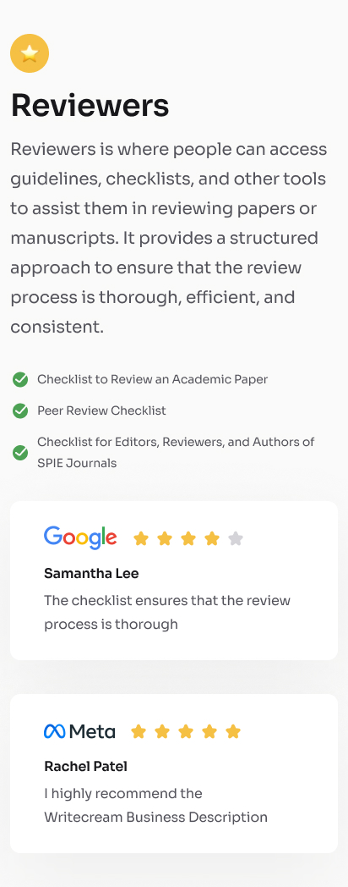

# Testimonial Page Challenge | devChallenges.io




---

## Overview
This project is a responsive testimonial page built as part of the devChallenges.io Testimonial Page challenge. The goal was to replicate a provided design as closely as possible using only HTML and CSS. The page features a clean, modern layout with a left-aligned checklist and staggered testimonial cards for Google and Meta, matching the reference design.

| Desktop | Tablet | Mobile |
| ------- | ------ | ------ |
|  |  |  |

## Features
- Responsive layout for desktop and mobile
- Modern, accessible HTML and CSS
- Custom SVG and PNG assets for brand and icons
- Staggered testimonial card layout (Google floats right, Meta floats left)
- Clean, professional design matching the challenge reference

## Built With
- HTML5
- CSS3 (no frameworks)
- [Inter](https://fonts.google.com/specimen/Inter) font (system fallback)

## Getting Started
1. Clone the repository:
   ```sh
   git clone https://github.com/Ayokanmi-Adejola/Testimonial-Page
   cd testimonial-page
   ```
2. Open `index.html` in your browser.
3. All assets are included in the `resources/` and `design/` folders.

## What I Learned
- Advanced CSS layout techniques (flexbox, alignment, staggered cards)
- How to closely match a pixel-perfect design
- Improved skills in structuring semantic HTML for accessibility
- Responsive design best practices

## Useful Resources
- [devChallenges.io](https://devchallenges.io/)
- [CSS Tricks: Flexbox Guide](https://css-tricks.com/snippets/css/a-guide-to-flexbox/)
- [Google Fonts: Inter](https://fonts.google.com/specimen/Inter)
